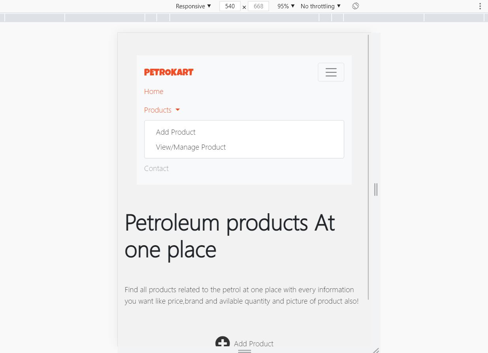

# Petroleum product management
Responsive Petroleum product management website developed using Bootstrap,HTML5,CSS3,Javascript and JQuery. 
User can add the product using the form and also view the products in the bootstrap cards after clicking the specific cart-item modal opens up which shows the entire details of the product. 
User can click on the edit button to update the previously entered information. also user can delete the product by clicking on the "X" button on cart. 
User can search using search bar. It will search and display only products matching the text in the search bar. 

Following are screenshots of website in both desktop and mobile view 
• A glimpse of the desktop view: 
**HOME PAGE**  
 
**ADD PRODUCTS SECTION**  
 
**VIEW PRODUCTS SECTION**  
 
**OPEN MODAL**  
 
**CONTACT PAGE**  
 

• A glimpse of the mobile view:
Navbar gets converted into the hamburger menu and carousel of home page is hidden and other sections are also modified accordingly. 
**HAMBURGER MENU**  
 

 Thank You Very Much!!
